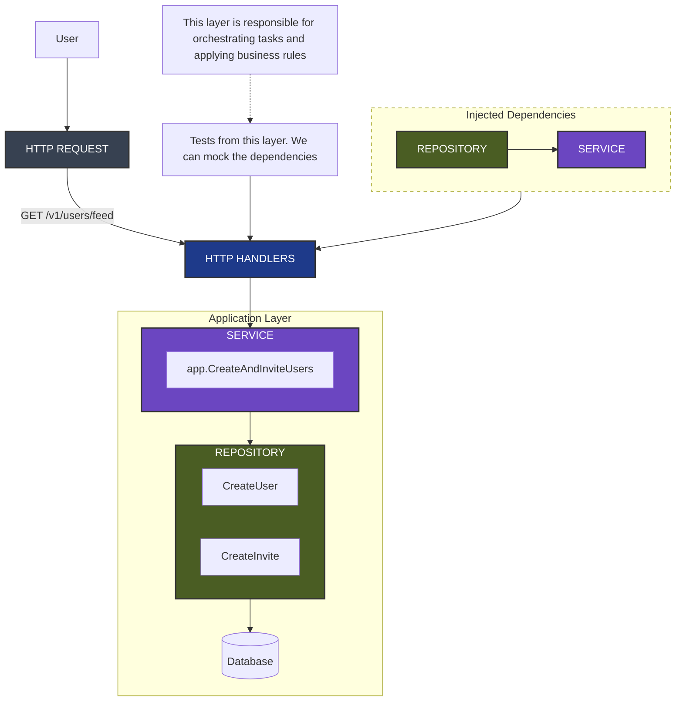
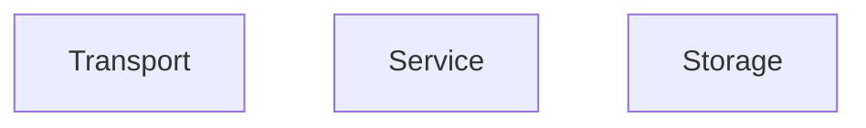
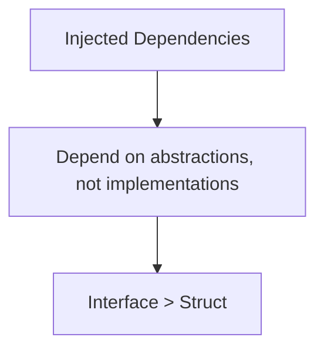

# Application Architecture

```mermaid
flowchart TD
    User[User] --> HTTPReq[HTTP REQUEST]
    HTTPReq -->|GET /v1/users/feed| HTTPHandlers[HTTP HANDLERS]

    subgraph InjectedDeps[Injected Dependencies]
        RepoTop[REPOSITORY]
        ServiceTop[SERVICE]
        RepoTop --> ServiceTop
    end

    subgraph AppLayer[Application Layer]
        subgraph Service[SERVICE]
        app[app.CreateAndInviteUsers]
        end
        subgraph Repository[REPOSITORY]
            CreateUser[CreateUser]
            CreateInvite[CreateInvite]
        end
        Service --> Repository
        Repository --> D[(Database)]
    end

    Test[Tests from this layer. We can mock the dependencies] --> HTTPHandlers
    Also[This layer is responsible for orchestrating tasks and applying business rules]-.-> Test

    HTTPHandlers --> Service
    InjectedDeps --> HTTPHandlers


    classDef repository fill:#4a5d23,stroke:#333,stroke-width:2px,color:#fff
    classDef service fill:#6b46c1,stroke:#333,stroke-width:2px,color:#fff
    classDef handler fill:#1e3a8a,stroke:#333,stroke-width:2px,color:#fff
    classDef request fill:#374151,stroke:#333,stroke-width:2px,color:#fff
    classDef invisible fill:transparent,stroke:none,color:transparent
    classDef dashedBox stroke-dasharray: 5 5

    class RepoTop,Repository repository
    class ServiceTop,Service service
    class HTTPHandlers handler
    class HTTPReq request
    class TestNote,ComposeNote,ServiceNote,InterfaceNote invisible
    class InjectedDeps dashedBox
```

## Layers

```mermaid
flowchart TD
    Transport
    Service
Storage

```

## Dependencies

```mermaid
flowchart TD
   Injected[Injected Dependencies]--> Depend[Depend on abstractions, not implementations]
    Depend --> Interface[Interface > Struct]


```
