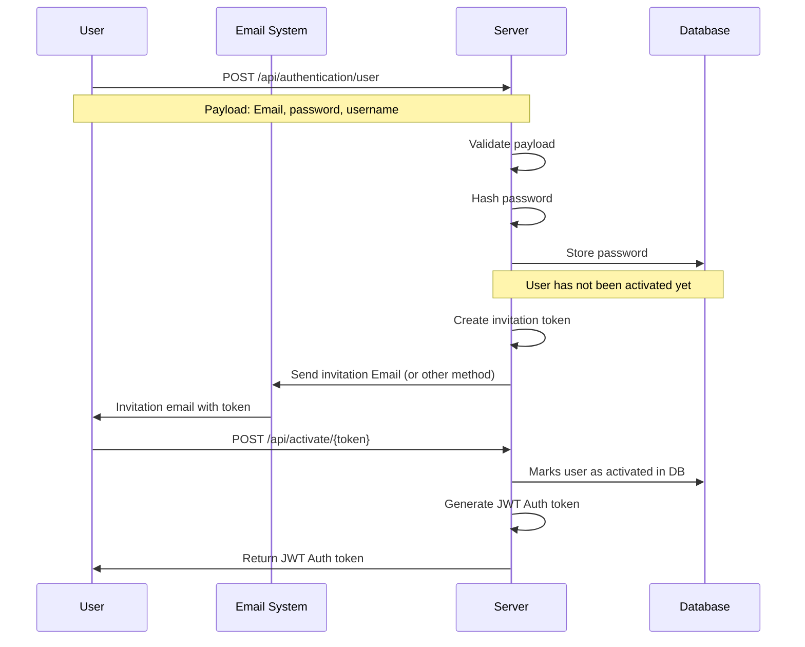

# Auth Workflow

```mermaid
sequenceDiagram
    participant User
    participant Email as Email System
    participant Server
    participant DB as Database

    User->>Server: POST /api/authentication/user
    Note over User,Server: Payload: Email, password, username

    Server->>Server: Validate payload
    Server->>Server: Hash password
    Server->>DB: Store password
    Note over Server,DB: User has not been activated yet
    Server->>Server: Create invitation token
    Server->>Email: Send invitation Email (or other method)

    Email->>User: Invitation email with token
    User->>Server: POST /api/activate/{token}
    Server->>DB: Marks user as activated in DB
    Server->>Server: Generate JWT Auth token
    Server->>User: Return JWT Auth token
```
