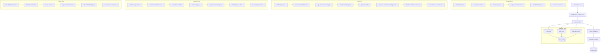

# Crud Flow

```mermaid
flowchart TD
      Client[Client Request] --> Router[Chi Router + Middleware]
      Router --> Handler[API Handler]

      Handler --> Validate[JSON Validation]
      Validate --> Store[Storage Interface]
      Store --> DB[(PostgreSQL)]

      subgraph Create["Create Flow"]
          C1[POST /v1/posts] --> C2[createPostHandler]
          C2 --> C3[Validate Payload]
          C3 --> C4[app.store.Posts.Create]
          C4 --> C5[INSERT INTO posts]
          C5 --> C6[Return Created Post]
      end

      subgraph Read["Read Flow"]
          R1[GET /v1/posts/:id] --> R2[postsContextMiddleware]
          R2 --> R3[app.store.Posts.GetByID]
          R3 --> R4[SELECT FROM posts]
          R4 --> R5[getPostHandler]
          R5 --> R6[app.store.Comments.GetByPostID]
          R6 --> R7[SELECT FROM comments]
          R7 --> R8[Return Post + Comments]
      end

      subgraph Update["Update Flow"]
          U1[PATCH /v1/posts/:id] --> U2[postsContextMiddleware]
          U2 --> U3[updatePostHandler]
          U3 --> U4[Validate Payload]
          U4 --> U5[app.store.Posts.Update]
          U5 --> U6[UPDATE posts SET...]
          U6 --> U7[Return Updated Post]
      end

      subgraph Delete["Delete Flow"]
          D1[DELETE /v1/posts/:id] --> D2[deletePostHandler]
          D2 --> D3[Parse Post ID]
          D3 --> D4[app.store.Posts.Delete]
          D4 --> D5[DELETE FROM posts]
          D5 --> D6[Return 204 No Content]
      end

      subgraph Storage["Storage Layer"]
          PostStore[PostStore] --> PostgresDB[(PostgreSQL)]
          UserStore[UserStore] --> PostgresDB
          CommentStore[CommentStore] --> PostgresDB
      end

      Handler --> PostStore
      Handler --> UserStore
      Handler --> CommentStore
```
