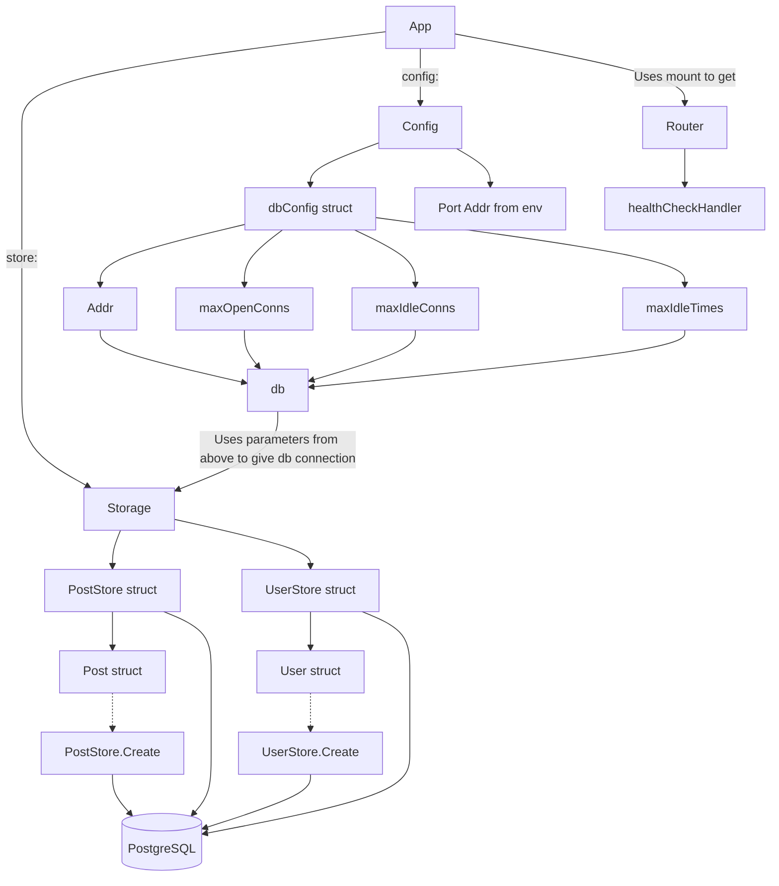

# DB Call Flow

```mermaid
flowchart TD


    App -->|store:| Storage
    App -->|config:| Config
    App -->|Uses mount to get | Router

    Config --> DbConfig[dbConfig struct]
    Config --> Port[Port Addr from env]
    DbConfig --> Addr
    DbConfig --> maxOpenConns
    DbConfig --> maxIdleConns
    DbConfig --> maxIdleTimes

    Addr --> db
    maxOpenConns --> db
    maxIdleConns --> db
    maxIdleTimes --> db


    db -->|Uses parameters from above to give db connection|Storage
    Storage --> PostStore[PostStore struct]
    Storage --> UserStore[UserStore struct]

    PostStore --> PostModel[Post struct]
    UserStore --> UserModel[User struct]

    Router --> HealthHandler[healthCheckHandler]

    PostStore --> DB[(PostgreSQL)]
    UserStore --> DB

    PostModel -.-> PostCreate[PostStore.Create]
    UserModel -.-> UserCreate[UserStore.Create]

    PostCreate --> DB
    UserCreate --> DB
```
