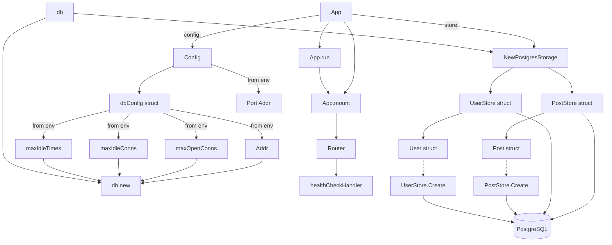

# DB Call Flow

```mermaid
flowchart TD


    App -->|store:| NewPostgresStorage
    App -->|config:| Config
    App --> Mount[App.mount]
    App --> Run[App.run]
    Run --> Mount
    Mount --> Router

    Config --> DbConfig[dbConfig struct]
    Config -->|from env| Port[Port Addr]
    DbConfig -->|from env| Addr
    DbConfig -->|from env| maxOpenConns
    DbConfig -->|from env| maxIdleConns
    DbConfig -->|from env| maxIdleTimes

    Addr --> db.new
    maxOpenConns --> db.new
    maxIdleConns --> db.new
    maxIdleTimes --> db.new

    db --> db.new
    db --> NewPostgresStorage
    NewPostgresStorage --> PostStore[PostStore struct]
    NewPostgresStorage --> UserStore[UserStore struct]

    PostStore --> PostModel[Post struct]
    UserStore --> UserModel[User struct]

    Router --> HealthHandler[healthCheckHandler]

    PostStore --> DB[(PostgreSQL)]
    UserStore --> DB

    PostModel -.-> PostCreate[PostStore.Create]
    UserModel -.-> UserCreate[UserStore.Create]

    PostCreate --> DB
    UserCreate --> DB
```
