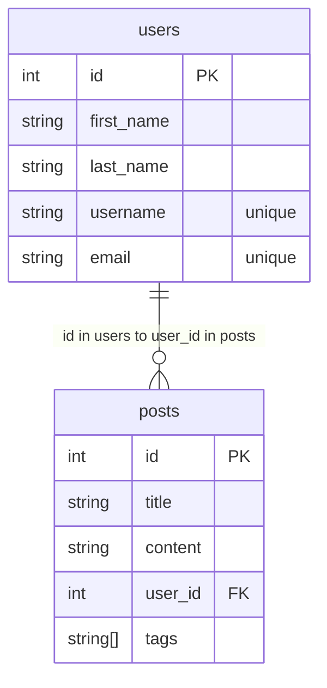

# Database Design

- One user can have many posts (one-to-many from users to posts)

- One post can only have one user (each post belongs to exactly one user)

```mermaid
erDiagram
    users {
        int id PK
        string first_name
        string last_name
        string username "unique"
        string email "unique"
    }

    posts {
        int id PK
        string title
        string content
        int user_id FK
        string[] tags
    }

    users ||--o{ posts : "id in users to user_id in posts"
```
