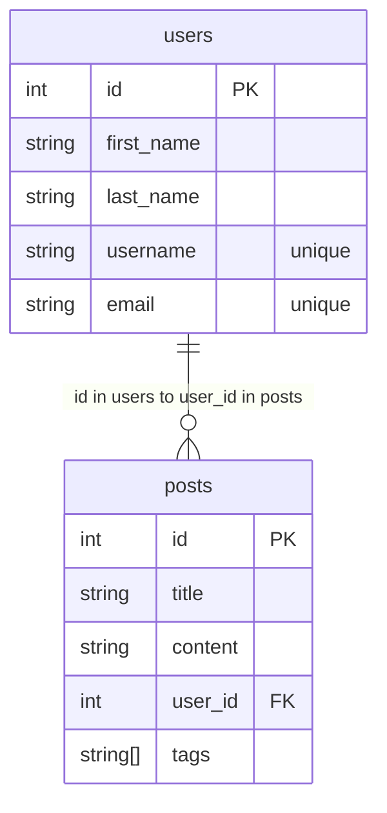

# Database Design

- One user can have many posts (one-to-many from users to posts)

- One post can only have one user (each post belongs to exactly one user)



## Database Migration Design

### Sequential Migration Execution

When the instructor mentions storing migrations and running them sequentially, he's referring to the **migration management system** that ensures database schema changes are applied in the correct order. Here's how it works:

#### Migration Files Storage

- **Migration files are stored** in a dedicated `migrations` folder within the project structure
- Each migration file has a **timestamp or version number** prefix to ensure proper ordering
- Files are named descriptively (e.g., "001_add_roles_table.up.sql", "002_alter_users_with_roles.up.sql")

#### Sequential Execution Process

**1. Makefile Script Execution:**

- There's a **Makefile command** (`make migrate up`) that runs migrations against the database
- The script references the `DB_ADDRESS` environment variable to connect to the target database
- Migrations are executed **one by one** in chronological order

**2. Why Sequential Order Matters:**

```sql
-- Migration 1: Create roles table first
CREATE TABLE roles (
    id BIGSERIAL PRIMARY KEY,
    name VARCHAR(255) NOT NULL UNIQUE,
    level INTEGER NOT NULL DEFAULT 0
);

-- Migration 2: Add role_id to users table (depends on roles existing)
ALTER TABLE users ADD COLUMN role_id INTEGER REFERENCES roles(id);
```

#### Key Benefits of Sequential Execution

**Dependency Management:** Later migrations can depend on earlier ones (like adding foreign keys to tables created in previous migrations)

**Production Safety:** In production environments with existing data, you can't just delete and recreate - you must **carefully alter existing structures** step by step

**Rollback Capability:** Each migration has an "up" and "down" version, allowing you to roll back changes in reverse order if needed

**State Tracking:** The migration system tracks which migrations have been applied, preventing duplicate execution

This sequential approach ensures that database schema changes are predictable, reversible, and safe for both development and production environments.
