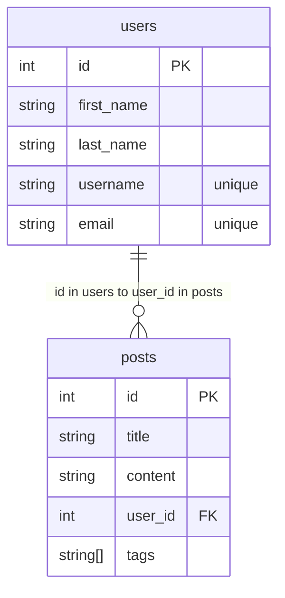

# Database Design

- One user can have many posts (one-to-many from users to posts)
- One post can only have one user (each post belongs to exactly one user)



## Database Migration Design

### Sequential Migration Execution

#### Database Tool

##### - Golang migration

##### - citext extension

The citext extension in PostgreSQL provides a case-insensitive text data type.
When you use citext, string comparisons are performed without regard to case,
making it useful for storing data like email addresses, usernames,
or other text fields where case shouldn't matter for equality checks.

## Migrate Commands

### Create Migration

```bash
migrate create -seq -ext sql -dir ./cmd/migrate/migrations create_users
```

**Generates:**

```text
000001_create_users.up.sql
000001_create_users.down.sql
```

### Parameters

- `-seq` - Sequential numbering
- `-ext sql` - SQL file extension
- `-dir` - Output directory

## Database Migration Tool Summary

### Why Sequential Migrations Are Essential

Sequential database migrations solve a critical problem: **managing database
schema changes safely across different environments**. Without this approach,
you'd face chaos when multiple developers make conflicting database changes or
when deploying to production with existing data.

The core reasons this matters:

- **Dependency management** - Later changes often depend on earlier ones (you
  can't add a foreign key to a non-existent table)
- **Production safety** - You can't just wipe and recreate production
  databases; changes must be incremental
- **Team coordination** - Multiple developers need a consistent way to apply
  the same schema changes
- **Rollback capability** - When things go wrong, you need to undo changes in
  reverse order

### How the System Works

**File Organization:**

- Migration files live in a dedicated `migrations` folder
- Each file gets a timestamp/version prefix (001, 002, 003...)
- Descriptive naming like "001_add_roles_table.up.sql"

**Execution Process:**

1. **Makefile command** (`make migrate up`) triggers the process
2. **Database connection** uses the `DB_ADDRESS` environment variable
3. **Sequential execution** - the system runs migrations in chronological order
4. **State tracking** - the database remembers which migrations have been
   applied

**Practical Example:**

```sql
Migration 1: CREATE TABLE roles (...)
Migration 2: ALTER TABLE users ADD COLUMN role_id REFERENCES roles(id)
```

Migration 2 would fail if run before Migration 1 because it references a table
that doesn't exist yet.

The beauty is in the simplicity - by enforcing order and tracking state, this
system prevents the database schema chaos that would otherwise plague
multi-developer projects and production deployments.
