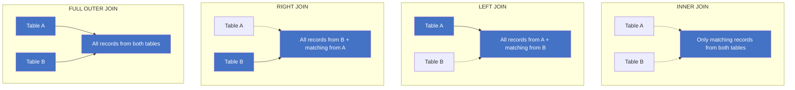

# SQL CHEATSHEET

Sources: W3Schools.com, DataQuest.io

## Commands / Clauses

**SELECT** - Select data from database  
**FROM** - Specify table we're pulling from  
**WHERE** - Filter query to match a condition  
**AS** - Rename column name with alias  
**JOIN** - Combine rows from 2 or more tables  
**AND** - Combine query conditions. All must be met  
**OR** - Combine query conditions. One must be met  
**LIMIT** - Limit rows returned. See also FETCH & TOP  
**IN** - Specify multiple values when using WHERE  
**CASE** - Return value on a specified condition  
**IS NULL** - Return only rows with a NULL value  
**LIKE** - Search for patterns in column  
**COMMIT** - Write transaction to database  
**ROLLBACK** - Undo a transaction block
**ALTER TABLE** - Add/Remove columns from table  
**UPDATE** - Update table data  
**CREATE** - Create TABLE, DATABASE, INDEX or VIEW  
**DELETE** - Delete rows from table  
**INSERT** - Add single row to table  
**DROP** - Delete TABLE, DATABASE, or INDEX
**GROUP BY** - Group data into logical sets  
**ORDER BY** - Set order of result. Use DESC to reverse order  
**HAVING** - Same as WHERE but filters groups  
**COUNT** - Count number of rows  
**SUM** - Return sum of column  
**AVG** - Return average of column  
**MIN** - Return min value of column  
**MAX** - Return max value of column

## Joins



**INNER JOIN** - Returns records that have matching values in both tables
**LEFT JOIN** - Returns all records from the left table, and matched records
from the right table  
**RIGHT JOIN** - Returns all records from the right table, and matched records
from the left table  
**FULL OUTER JOIN** - Returns all records when there is a match in either left
or right table

## Order of Execution

1. **FROM**
2. **WHERE**
3. **GROUP BY**
4. **HAVING**
5. **SELECT**
6. **ORDER BY**
7. **LIMIT**

## Data Definition Language

### CREATE

```sql
CREATE DATABASE MyDatabase;
CREATE TABLE MyTable (
    id int,
    name varchar(255)
);
CREATE INDEX IndexName
ON TableName(col1);
```

### ALTER

```sql
ALTER TABLE MyTable
DROP COLUMN col5;
ALTER TABLE MyTable
ADD col5 int;
```

### DROP

```sql
DROP DATABASE MyDatabase;
DROP TABLE MyTable;
```

## Data Manipulation Language

### UPDATE

```sql
UPDATE MyTable
SET col1 = 'something';
WHERE col2 = 'something';
```

### INSERT

```sql
INSERT INTO MyTable (col1, col2)
VALUES ('value1', 'value2');
```

### DELETE

```sql
DELETE FROM MyTable
WHERE col1 = 'something';
```

### SELECT

```sql
SELECT col1, col2
FROM MyTable;
```

## Examples

### Select all columns with filter applied

```sql
SELECT * FROM tbl
WHERE col > 5;
```

### Select first 10 rows for two columns

```sql
SELECT col1, col2
FROM tbl LIMIT 10;
```

### Select all columns with multiple filters

```sql
SELECT * FROM tbl
WHERE col1 = 0 OR col2 < 2;
```

### Select all rows from col1 & col2 ordering by col1

```sql
SELECT col1, col2
FROM tbl ORDER BY 1;
```

### Return count of rows in table

```sql
SELECT COUNT(*)
FROM tbl;
```

### Return sum of col1

```sql
SELECT SUM(col1)
FROM tbl;
```

### Return max value for col1

```sql
SELECT MAX(col1)
FROM tbl;
```

### Compute summary stats by grouping col2

```sql
SELECT AVG(col1) FROM tbl
GROUP BY col2;
```

### Combine data from 2 tables using left join

```sq:w
SELECT * FROM tbl1 AS t1 LEFT JOIN
tbl2 AS t2 ON t2.col1 = t1.col1;
```

### Aggregate and filter result

```sql
SELECT col1,
       COUNT(*) AS total
FROM tbl
GROUP BY col1
HAVING COUNT(*) > 10;
```

### Implementation of CASE statement

```sql
SELECT col1,
CASE
    WHEN col1 >= 10 THEN 'more than 10'
    WHEN col1 < 10 THEN 'less than 10'
    ELSE '10'
END AS NewColumnName
FROM tbl;
```
